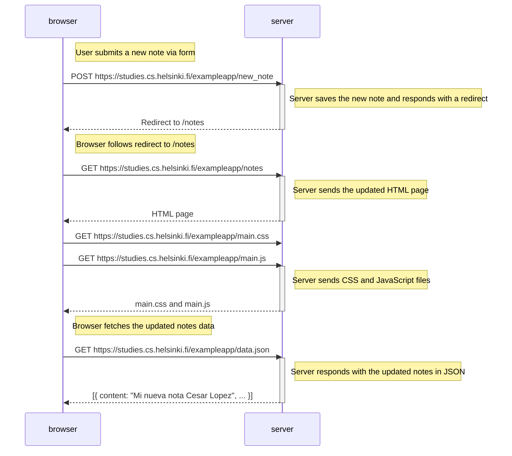

```mermaid
sequenceDiagram

    participant browser
    participant server

    Note right of browser: User submits a new note via form

    browser->>server: POST https://studies.cs.helsinki.fi/exampleapp/new_note
    activate server
    Note right of server: Server saves the new note and responds with a redirect
    server-->>browser: Redirect to /notes
    deactivate server

    Note right of browser: Browser follows redirect to /notes

    browser->>server: GET https://studies.cs.helsinki.fi/exampleapp/notes
    activate server
    Note right of server: Server sends the updated HTML page
    server-->>browser: HTML page
    deactivate server

    browser->>server: GET https://studies.cs.helsinki.fi/exampleapp/main.css
    browser->>server: GET https://studies.cs.helsinki.fi/exampleapp/main.js
    activate server
    Note right of server: Server sends CSS and JavaScript files
    server-->>browser: main.css and main.js
    deactivate server

    Note right of browser: Browser fetches the updated notes data

    browser->>server: GET https://studies.cs.helsinki.fi/exampleapp/data.json
    activate server
    Note right of server: Server responds with the updated notes in JSON
    server-->>browser: [{ content: "Mi nueva nota Cesar Lopez", ... }]
    deactivate server
```