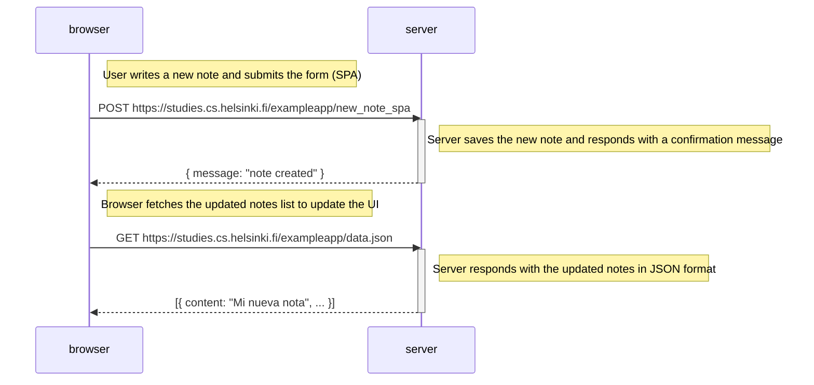

```mermaid
sequenceDiagram

    participant browser
    participant server

    Note right of browser: User writes a new note and submits the form (SPA)
    
    browser->>server: POST https://studies.cs.helsinki.fi/exampleapp/new_note_spa
    activate server
    Note right of server: Server saves the new note and responds with a confirmation message
    server-->>browser: { message: "note created" }
    deactivate server

    Note right of browser: Browser fetches the updated notes list to update the UI

    browser->>server: GET https://studies.cs.helsinki.fi/exampleapp/data.json
    activate server
    Note right of server: Server responds with the updated notes in JSON format
    server-->>browser: [{ content: "Mi nueva nota", ... }]
    deactivate server
```