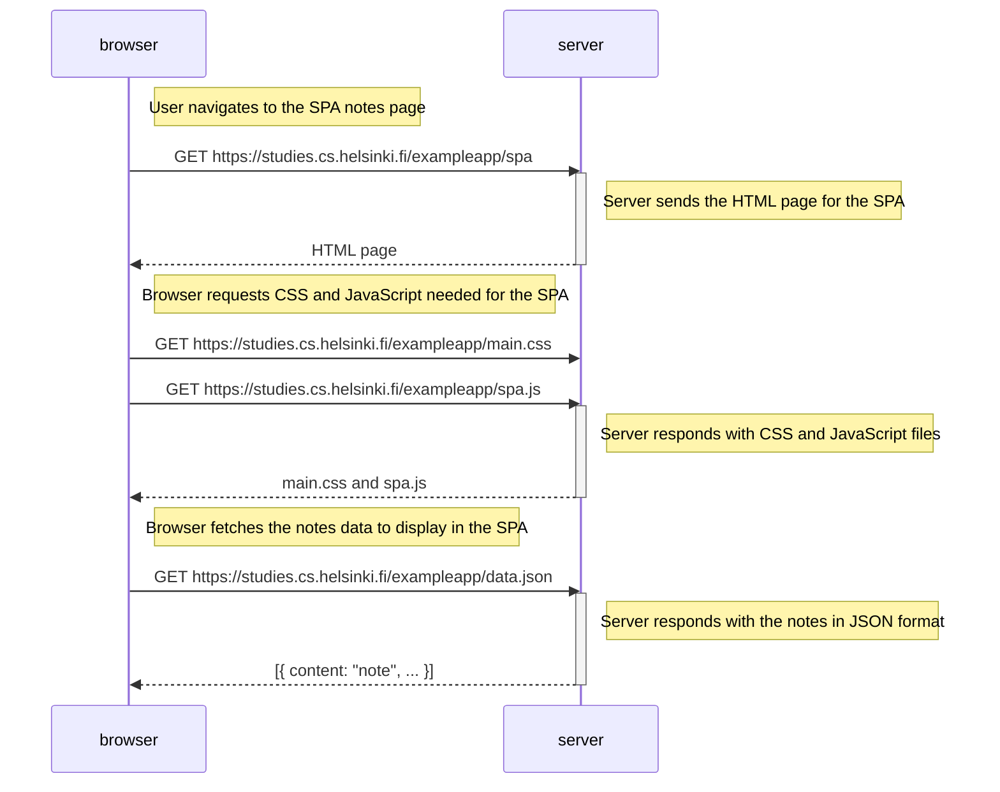

```mermaid
sequenceDiagram

    participant browser
    participant server

    Note right of browser: User navigates to the SPA notes page

    browser->>server: GET https://studies.cs.helsinki.fi/exampleapp/spa
    activate server
    Note right of server: Server sends the HTML page for the SPA
    server-->>browser: HTML page
    deactivate server

    Note right of browser: Browser requests CSS and JavaScript needed for the SPA

    browser->>server: GET https://studies.cs.helsinki.fi/exampleapp/main.css
    browser->>server: GET https://studies.cs.helsinki.fi/exampleapp/spa.js
    activate server
    Note right of server: Server responds with CSS and JavaScript files
    server-->>browser: main.css and spa.js
    deactivate server
    
    Note right of browser: Browser fetches the notes data to display in the SPA

    browser->>server: GET https://studies.cs.helsinki.fi/exampleapp/data.json
    activate server
    Note right of server: Server responds with the notes in JSON format
    server-->>browser: [{ content: "note", ... }]
    deactivate server
```